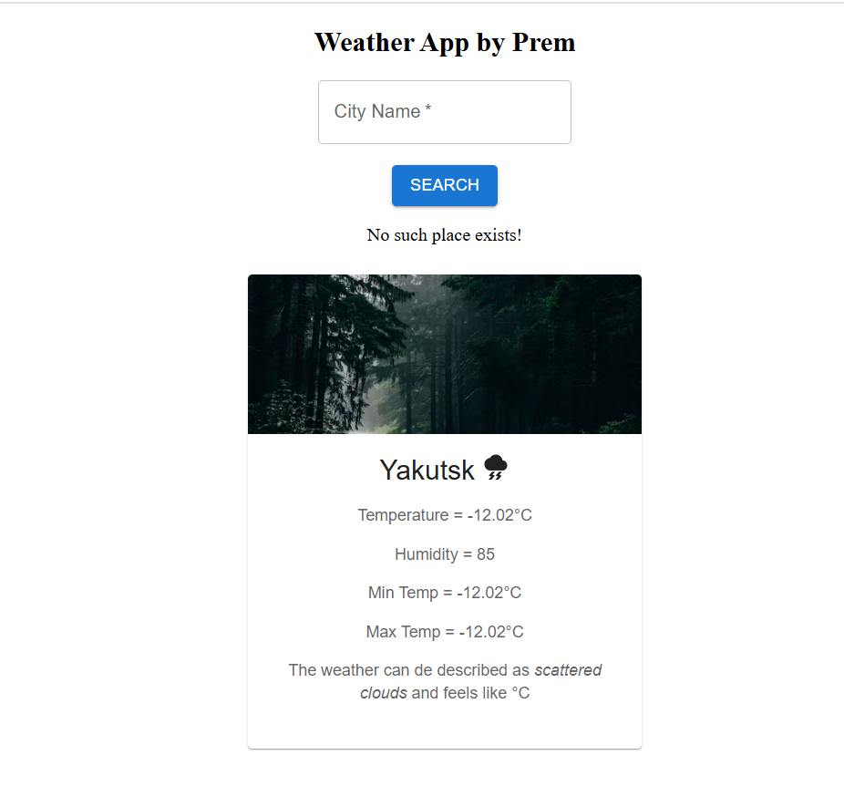

# Weather App

This is a simple weather application built using ReactJS. The application allows users to view the current weather details for a specified location.

## Features

- Display current weather conditions
- Show temperature, humidity, and wind speed
- Search for weather by city name

## Installation

1. Clone the repository:
  ```bash
  git clone https://github.com/yourusername/weather-app.git
  ```
2. Navigate to the project directory:
  ```bash
  cd weather-app
  ```
3. Install the dependencies:
  ```bash
  npm install
  ```

## Screenshot




1. Clone the repository:
  ```bash
  git clone https://github.com/yourusername/weather-app.git
  ```
2. Navigate to the project directory:
  ```bash
  cd weather-app
  ```
3. Install the dependencies:
  ```bash
  npm install
  ```

## Usage

1. Start the development server:
  ```bash
  npm start
  ```
2. Open your browser and go to `http://localhost:3000`

## Technologies Used

- ReactJS
- Axios (for API calls)
- OpenWeatherMap API

## Contributing

Contributions are welcome! Please open an issue or submit a pull request for any changes.

## License

This project is licensed under the MIT License.

## Acknowledgements

- [OpenWeatherMap](https://openweathermap.org/) for providing the weather data API.
